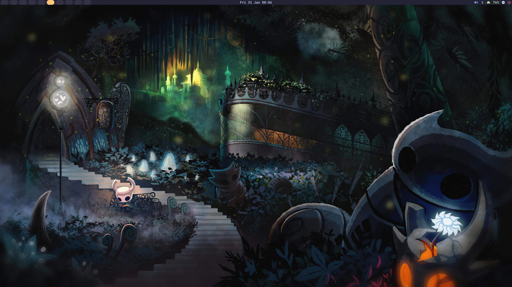
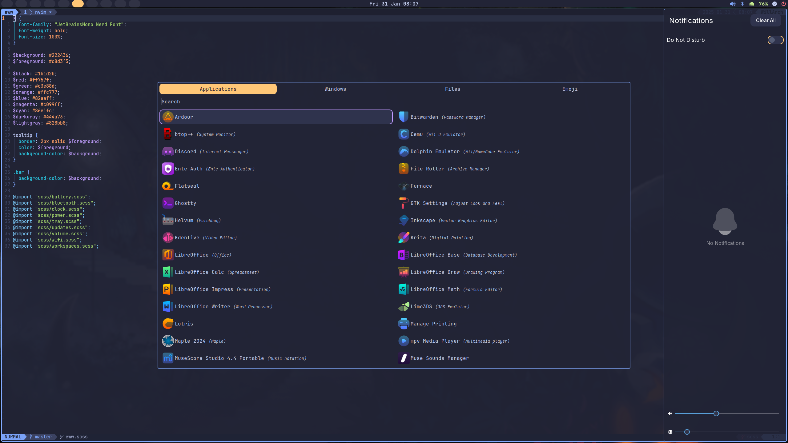

# My Dotfiles





## List of programs

### Hyprland Desktop Environment

- Eww (AUR)
- Ghostty
- Grim
- Hypridle
- Hyprland
- Hyprlock
- Hyprpaper
- Hyprpolkit
- Hyprsunset
- Rbw
- Rofi-wayland
- Slurp
- Swappy
- Swaync
- Uwsm

### Greeter

- Nwg-hello

### Terminal Programs

- Bluetui
- Btop
- Dash
- Eza
- Fastfetch
- Fzf
- Jq
- Latexindent
- Mpd
- Mpv
- Neovim
- Networkmanger
- Ncmpcpp
- Playerctl
- Python
- Tmux
- Yazi
- Zoxide
- Zsh

### Other Programs

- Zathura

## Installation

Ensure you have the following installed on your system

```Bash
sudo pacman -S git stow
```

Then run the following commands from the home directory

```Bash
git clone https://github.com/Buppy-212/Dotfiles.git
cd Dotfiles
stow --dotfiles .
```
