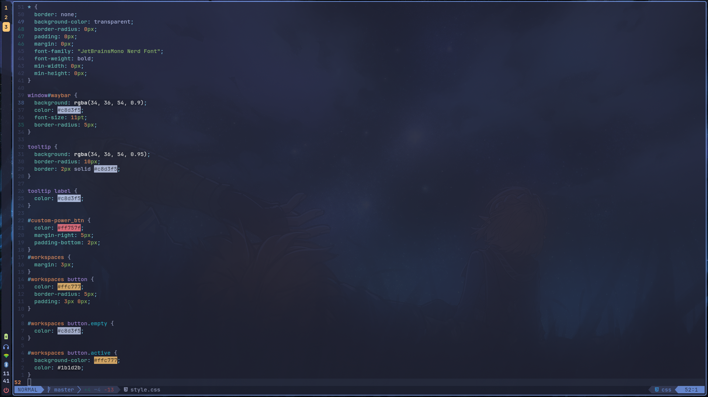
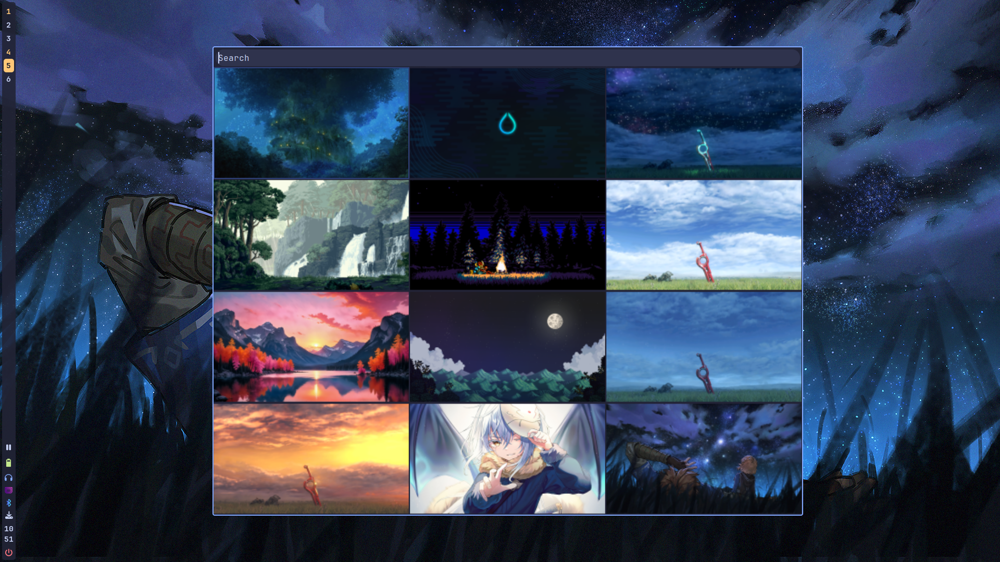

# My Dotfiles




## List of programs

### Hyprland Desktop Environment

- Hyprland
- Hypridle
- Hyprlock
- Hyprpaper
- Rofi-wayland
- Rofi-emoji-git (AUR)
- Waybar
- Swaync
- Swappy
- Slurp (for printscreen)
- Grim (for printscreen)
- Ghostty

### Terminal Programs

- Zsh
- Eza
- Zoxide
- Btop
- Yazi
- Fastfetch
- Fzf
- Neovim
- Mpv

### Other Programs

- Zathura

## Installation

Ensure you have the following installed on your system

### Git

```Bash
sudo pacman -S git
```

### Stow

```Bash
sudo pacman -S stow
```

Then run the following commands from the home directory

```Bash
git clone https://github.com/Buppy-212/Dotfiles.git
cd Dotfiles
stow .
```
