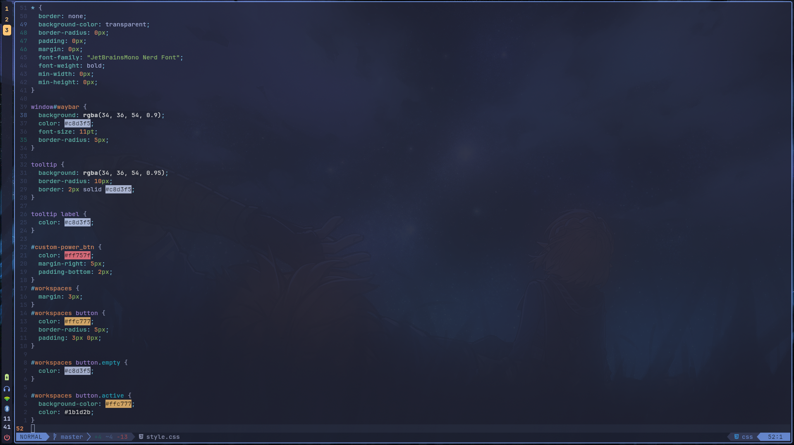
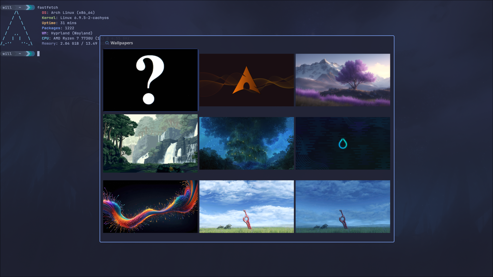

# My Dotfiles




## List of programs

- Hyprland
- Hypridle
- Hyprlock
- Hyprpaper
- Wofi
- Wlogout (AUR)
- Waybar
- Zathura
- Kitty
- Starship
- Eza
- Zoxide
- Btop
- Yazi
- Fastfetch
- Cli-visualizer "vis" (AUR)
- Fzf
- Tmux
- Neovim "nvim"
- Mako
- Mpv
- Swappy
- Grim (for printscreen)
- Slurp (for printscreen)

## Installation

Ensure you have the following installed on your system

### Git

```
sudo pacman -S git
```

### Stow

```
sudo pacman -S stow
```

Then run the following commands from the home directory

```
$ https://github.com/Buppy-212/Dotfiles.git
$ cd Dotfiles
$ stow .
```
